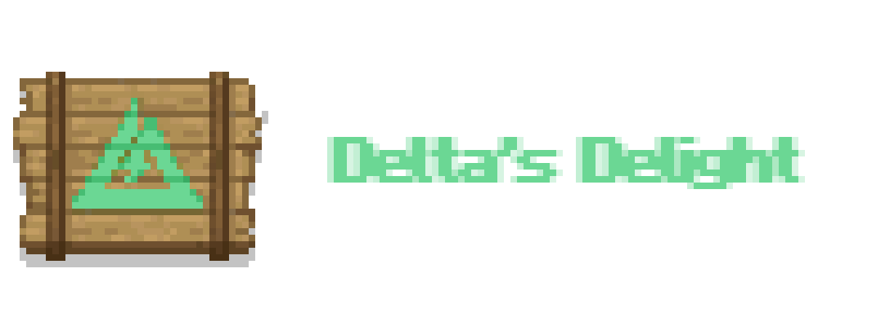

# 三角洲乐事

## 简介

三角洲乐事是面向 Minecraft 1.20.1 Forge 的农夫乐事附属Mod，将三角洲行动中的食物、饮品和（曾经的）调酒活动带入Minecraft。

-  丰富的食物与饮料：从香喷喷的炒面到奥莉薇娅香槟，三角洲乐事为玩家提供了多种美味选择，每种食物和饮料都有独特的效果和精致的模型。
-  创新的调酒系统：玩家可以根据不同的基底、配料和摇晃时间定制完全独一无二的鸡尾酒结果，享受调酒的乐趣。
-  非洲之心：在钻石矿中寻找这个稀有物品，并与村民进行高价交易，增加了游戏的探索和交易元素。

## 画廊

银烛自己贴图

## 作者的话

不是，怎么普弓还有蹲撤离点的

## 更多信息
查看三角洲乐事的 [CurseForge] 或是 [Modrinth] 界面以看到更多内容！

[CurseForge]: https://www.curseforge.com/minecraft/mc-mods/delta-delight
[Modrinth]: https://modrinth.com/mod/delta-delight