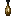

<h1 align="center">三角洲乐事
     
    
    
    
</h1>

<h3>简介</h3>

三角洲乐事是基于农夫乐事的扩展Mod，将三角洲游戏行动中的食物复现到我的世界之中去！

<ul>
    <li> 包括更多的食物，许多食物有着精致的模型。</li>
    <li> 全新的调酒系统，具有较高自由度以自定义自己想要的酒。(开发中)</li>
    <li> 更多模组内容持续更新中...</li>
</ul>

<h3>画廊</h3>

银烛自己贴图

<h3>作者的话</h3>

银烛自己写

如果遇到bug或者有什么问题可以提交issue！

<h3>更多信息</h3>

查看三角洲乐事的<a href="">CurseForge</a>或是<a href="">Modrinth</a>界面以看到更多内容！
